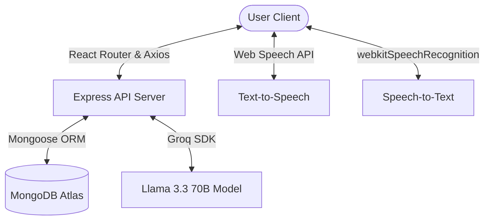

# Arogya AI - Project Overview & Key Features

Arogya AI is a full-stack, safety-first public health chatbot application built on the **MERN (MongoDB, Express.js, React, Node.js)** stack and integrated with **Groq AI (Llama 3.3 70B)**. It is designed to provide high-quality health awareness, disease information, and symptom guides in both English and Hindi.

---

## 🏗️ Architecture & Flow Diagram

Here is how data flows through Arogya AI:



---

## 🌟 Key Features

### 1. Safety-First AI Triage Engine
* **Context-Aware Health Responses**: Integrated with `llama-3.3-70b-versatile` via Groq Cloud, configured with strict WHO and Ministry of Health (India) guidelines to prioritize safety, clarity, and consistency over creativity.
* **Automatic Risk Classification**: Detects critical symptoms (e.g., chest pain, breathing difficulties) and appends color-coded risk flags:
  * 🔴 **HIGH RISK** (Immediate Doctor Visit)
  * 🟡 **MEDIUM RISK** (Early warning symptoms to monitor)
  * 🟢 **LOW RISK** (General health and prevention tips)
* **Topic Restriction**: Politely declines inquiries unrelated to medical or public health contexts.

### 2. Multi-lingual Accessibility & Voice Support
* **Speech-to-Text (Voice Input)**: Users can speak their symptoms. Toggleable between English (`en-US`) and Hindi (`hi-IN`).
* **Text-to-Speech (Read Aloud)**: High-quality speech synthesis with auto-detection of Devanagari script (Hindi characters) to switch voice profiles seamlessly.

### 3. Smart User Experience & Security
* **Disappearing Messages (History Retention)**: Option to automatically purge chats after 24 hours, 3 days, 7 days, 28 days, or keep them indefinitely.
* **Low Bandwidth Mode**: Disables animations and uses lightweight rendering for users on slow or metered internet connections.
* **Guest & Registered Modes**: Full access to the AI chatbot without logging in (guest mode), or sign up/log in with email and phone to preserve session histories.
* **Hospitals Locator**: Direct link to look up nearby government hospitals using geolocation on Google Maps.

---

## 🛠️ Technology Stack

| Layer | Technology | Key Libraries / Modules |
| :--- | :--- | :--- |
| **Frontend** | React (Vite) | `react-router-dom`, `lucide-react`, `react-markdown`, `remark-gfm` |
| **Backend** | Node.js, Express.js | `groq-sdk`, `jsonwebtoken`, `bcryptjs`, `cors`, `dotenv` |
| **Database** | MongoDB Atlas | `mongoose` (ORM) |
| **Hosting** | Vercel & Render | Client-side rewrites configured in `vercel.json` |

---

## 📂 Project Structure

```
ArogyaAI/
├── client/                     # Frontend (Vite + React)
│   ├── src/
│   │   ├── components/
│   │   │   └── ThemeToggle.jsx # Light/Dark mode switcher
│   │   ├── pages/
│   │   │   ├── Home.jsx        # Landing page with health cards & features
│   │   │   ├── Chat.jsx        # Chatbot UI with voice input & TTS features
│   │   │   └── Login.jsx       # Email & Mobile signup/signin page
│   │   ├── App.jsx             # Main Router configuration
│   │   └── index.css           # Global CSS styles & animations
│   ├── vercel.json             # Deployment routing
│   └── package.json
│
└── server/                     # Backend (Express.js)
    ├── models/
    │   ├── Chat.js             # Chat session schema
    │   ├── Message.js          # Individual message schema
    │   └── User.js             # User account & settings schema
    ├── routes/
    │   ├── auth.js             # JWT signup, login, settings updates
    │   └── chat.js             # Groq system prompt, risk evaluation, auto-cleanup
    ├── index.js                # App entrypoint & DB connection
    └── package.json
```

---

## 🔧 Basic Environment Configuration

To run Arogya AI locally, you require two configuration files:

### 1. Server Configuration (`server/.env`)
```env
PORT=5000
MONGODB_URI=mongodb+srv://<user>:<password>@cluster.mongodb.net/arogya
GROQ_API_KEY=gsk_***
JWT_SECRET=your_jwt_signing_key
```

### 2. Client Configuration (`client/.env.local`)
```env
VITE_API_URL=http://localhost:5000
```
